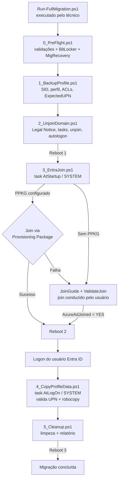

# ADDS to Entra ID Device Migration (adds2Entra)

Conjunto de scripts PowerShell para migrar computadores Windows ingressados em um domínio **Active Directory Domain Services (ADDS)** para **Microsoft Entra ID join**, com enrollment no **Microsoft Intune** e cópia dos dados do perfil do usuário.

O processo é orquestrado por scheduled tasks e estado persistido no registro, permitindo que as etapas e os reboots ocorram de forma automática. Nenhum domínio, tenant ou sufixo de UPN é fixo no código: todos os valores são fornecidos em tempo de execução ou pelo arquivo de configuração.

---

## Sumário

- [Funcionalidades](#funcionalidades)
- [Fluxo da migração](#fluxo-da-migração)
- [Requisitos](#requisitos)
- [Estrutura do repositório](#estrutura-do-repositório)
- [Configuração](#configuração)
- [Provisioning Package (opcional)](#provisioning-package-opcional)
- [How to](#how-to)
- [Estado e logs](#estado-e-logs)
- [Troubleshooting](#troubleshooting)
- [Segurança](#segurança)
- [Limitações](#limitações)
- [Referências](#referências)

---

## Funcionalidades

- **Pre-flight** de SO, estado de domínio/Entra, Intune, conectividade, disco, TPM e BitLocker.
- **Conta de recuperação local** (`MigRecovery`) com senha aleatória por máquina, exibida uma única vez e removida ao final.
- **Backup do mapeamento do perfil** (SID, caminho e ACLs) antes da saída do domínio.
- **Entra ID join sem interação** via Provisioning Package (bulk enrollment), com fallback para join guiado pelo usuário.
- **Validação de identidade**: os dados só são copiados se o usuário Entra logado corresponder ao UPN definido no início do processo.
- **Cópia do perfil** com `robocopy`, tratamento de exit codes e preservação do perfil original.
- **Cleanup automático**: tasks, conta de recuperação, autologon, Legal Notice, backup da chave BitLocker no Entra ID e relatório final.
- Compatível com **Windows PowerShell 5.1** e independente do idioma do SO (grupos locais resolvidos por SID).

---

## Fluxo da migração



| Etapa | Script | Contexto | Gatilho |
|---|---|---|---|
| 0 | `0_PreFlight.ps1` | Administrador local | Orquestrador |
| 1 | `1_BackupProfile.ps1` | Administrador local | Orquestrador |
| 2 | `2_UnjoinDomain.ps1` | Administrador local | Orquestrador |
| 3 | `3_EntraJoin.ps1` | SYSTEM | Scheduled task `AtStartup` |
| 3b | `ValidateJoin.ps1` (gerado) | SYSTEM | Scheduled task `AtLogOn` (somente no fallback) |
| 4 | `4_CopyProfileData.ps1` | SYSTEM | Scheduled task `AtLogOn` |
| 5 | `5_Cleanup.ps1` | SYSTEM | Chamado pela etapa 4 |

---

## Requisitos

### Dispositivo

- Windows 10 20H1 (build 19041) ou superior. Windows 11 recomendado quando for usado Provisioning Package.
- Windows PowerShell 5.1.
- Máquina ingressada no domínio ADDS, com o usuário de domínio a ser migrado logado no momento da execução.
- Mínimo de 2 GB livres na unidade do sistema.
- Acesso HTTPS (443) aos endpoints:
  - `login.microsoftonline.com`
  - `device.login.microsoftonline.com`
  - `enrollment.manage.microsoft.com`
  - `enterpriseregistration.windows.net`

### Tenant

- Usuários sincronizados ou existentes no Microsoft Entra ID com licença que inclua Intune.
- **Windows automatic enrollment** (MDM user scope) habilitado no Intune.
- Permissão para ingressar dispositivos no Entra ID (*Devices > Device settings > Users may join devices to Microsoft Entra*).
- Para Provisioning Package: requisitos de bulk enrollment descritos em [Provisioning Package (opcional)](#provisioning-package-opcional).

### Execução

- Credencial de administrador local no dispositivo.
- Credencial de domínio com permissão para remover o objeto de computador (opcional; sem ela o unjoin é feito localmente e o objeto permanece no AD).

---

## Estrutura do repositório

```
.
├── Run-FullMigration.ps1     # Orquestrador (etapas 0 a 2)
├── 0_PreFlight.ps1           # Pré-requisitos, BitLocker e conta de recuperação
├── 1_BackupProfile.ps1       # Mapeamento do perfil e ExpectedUPN
├── 2_UnjoinDomain.ps1        # Saída do domínio, tasks, Legal Notice e autologon
├── 3_EntraJoin.ps1           # Entra ID join (PPKG ou fallback manual)
├── 4_CopyProfileData.ps1     # Validação de identidade e cópia de dados
├── 5_Cleanup.ps1             # Limpeza final, BitLocker e relatório
├── MigrationConfig.json      # Configuração
└── .gitignore                # Impede o versionamento de *.ppkg
```

---

## Configuração

Arquivo `MigrationConfig.json`:

```json
{
  "LogPath": "C:\\MigrationLogs",
  "ProfileBackupPath": "C:\\MigrationBackup",
  "PPKGPath": "",
  "NewComputerNamePrefix": "",
  "RenameComputer": false,
  "RebootDelaySeconds": 30,
  "EntraUPNSuffix": ""
}
```

| Chave | Descrição |
|---|---|
| `LogPath` | Diretório de logs. Não deve estar dentro da pasta dos scripts, que é removida no cleanup. |
| `ProfileBackupPath` | Diretório do mapeamento do perfil (`ProfileMapping.json`) e do backup de ACLs. |
| `PPKGPath` | Caminho do Provisioning Package. Aceita caminho absoluto ou relativo à pasta dos scripts. Vazio desabilita o join automático. |
| `NewComputerNamePrefix` | Prefixo do novo nome do computador (sufixo aleatório de 4 letras). |
| `RenameComputer` | `true` renomeia o computador durante a etapa 2. |
| `RebootDelaySeconds` | Tempo de espera antes do Reboot 1. |
| `EntraUPNSuffix` | Sufixo de UPN usado **somente** quando o UPN não é informado pelo orquestrador nem encontrado no AD. |

**Ordem de resolução do UPN de destino (`ExpectedUPN`):**

1. Parâmetro `-TargetUPN` ou valor digitado no orquestrador.
2. Atributo `userPrincipalName` do usuário no AD.
3. `sAMAccountName` + `EntraUPNSuffix`.

---

## Provisioning Package (opcional)

O Provisioning Package (PPKG) com bulk token realiza o Entra ID join e o enrollment no Intune como SYSTEM, sem interação do usuário. Sem ele, o processo usa o join guiado (JoinGuide).

### Pré-requisitos do bulk enrollment

- Conta com uma das roles: **Cloud Device Administrator**, **Intune Administrator** ou **Password Administrator** (não restrita a Administrative Unit).
- Conta incluída no **MDM user scope** do Intune.
- Service principal `Microsoft.Azure.SyncFabric` (AppId `00000014-0000-0000-c000-000000000000`) presente no tenant:

  ```powershell
  Get-MgServicePrincipal -Filter "AppId eq '00000014-0000-0000-c000-000000000000'"
  # Se não existir:
  New-MgServicePrincipal -AppId "00000014-0000-0000-c000-000000000000"
  ```

- A obtenção do token aceita apenas senha ou CBA. Políticas de Conditional Access que exijam MFA para a conta ou para a ação *Register or join devices* precisam de exclusão para o processo de bulk enrollment.

### Geração do pacote

1. Instale o **Windows Configuration Designer** (Microsoft Store ou Windows ADK).
2. Selecione **Provision desktop devices**.
3. Em **Set up device**, desmarque a renomeação (ou configure conforme o padrão da organização).
4. Em **Set up network**, desative a configuração de rede, salvo se necessária.
5. Em **Account Management**, selecione **Enroll in Azure AD**, defina a **Bulk Token Expiry** (máximo de 180 dias) e clique em **Get Bulk Token**.
6. Na tela *Stay signed in to all your apps*, selecione **No, sign in to this app only**.
7. Em **Add applications** e **Add certificates**, não adicione itens.
8. Em **Finish**, clique em **Create** e copie o arquivo `.ppkg` para a pasta dos scripts.
9. Informe o nome do arquivo em `PPKGPath` no `MigrationConfig.json`.

> O PPKG contém um token de enrollment válido para o tenant. Não versione o arquivo (o `.gitignore` já exclui `*.ppkg`) e armazene-o com o mesmo cuidado de uma credencial. O token pode ser revogado removendo a conta `package_{GUID}` correspondente no Entra ID.

---

## How to

### 1. Preparar a pasta de execução

Copie os arquivos do repositório para uma pasta local no dispositivo, por exemplo `C:\Migration`. Caminhos de rede não são suportados, pois as scheduled tasks executam como SYSTEM após a saída do domínio.

```
C:\Migration\
├── Run-FullMigration.ps1
├── 0_PreFlight.ps1 ... 5_Cleanup.ps1
├── MigrationConfig.json
└── BulkEnrollment.ppkg        # opcional
```

### 2. Ajustar a configuração

Edite o `MigrationConfig.json`. Para join automático, informe o pacote:

```json
"PPKGPath": "BulkEnrollment.ppkg"
```

### 3. Executar o orquestrador

Com o **usuário de domínio a ser migrado logado** na sessão, abra o Windows PowerShell **como administrador** e execute:

```powershell
Set-ExecutionPolicy -Scope Process -ExecutionPolicy Bypass -Force
cd C:\Migration
.\Run-FullMigration.ps1
```

Parâmetros disponíveis:

| Parâmetro | Descrição |
|---|---|
| `-ConfigPath` | Caminho do arquivo de configuração. Padrão: `MigrationConfig.json` na pasta do script. |
| `-TargetUPN` | UPN de destino no Entra ID. Se omitido, é solicitado durante a execução. |
| `-DomainCredential` | Objeto `PSCredential` de domínio para o unjoin. |
| `-PromptDomainCredential` | Solicita a credencial de domínio via `Get-Credential`. |

Exemplos:

```powershell
# UPN informado na linha de comando e credencial de domínio solicitada
.\Run-FullMigration.ps1 -TargetUPN "usuario@contoso.com" -PromptDomainCredential

# Configuração em caminho alternativo
.\Run-FullMigration.ps1 -ConfigPath "D:\Config\MigrationConfig.json"
```

> Execute sempre pelo orquestrador. As etapas 0 a 2 precisam rodar no mesmo processo, pois a senha da conta de recuperação é protegida com DPAPI no escopo da sessão.

### 4. Registrar a credencial de recuperação

Durante o Pre-Flight, a credencial da conta `MigRecovery` é exibida **uma única vez**. Registre-a antes de pressionar ENTER. Ela não é gravada em log e é necessária caso o logon após o Reboot 1 falhe.

### 5. Acompanhar os reboots

| Momento | O que acontece | Ação necessária |
|---|---|---|
| Após a etapa 2 | Máquina sai do domínio e reinicia (Reboot 1). | Nenhuma. |
| Tela de logon | Legal Notice informa a migração e o usuário esperado. | Clicar em **OK**. |
| Boot | Etapa 3 executa o join via PPKG (se configurado). Em caso de sucesso, a máquina reinicia (Reboot 2). | Nenhuma. |
| Sem PPKG ou falha | Autologon do `MigRecovery`; o JoinGuide abre **Configurações > Acessar trabalho ou escola**. | Seguir as instruções e ingressar com o UPN exibido. A máquina reinicia ao concluir. |
| Após Reboot 2 | Tela de logon com Legal Notice. | Clicar em **OK** e entrar com a conta Entra ID (**Outro usuário**). |
| Logon Entra ID | Etapa 4 valida o UPN e copia os dados; etapa 5 faz a limpeza. | Aguardar a notificação de conclusão. |
| Final | Reboot 3 para aplicar políticas do Entra ID / Intune. | Nenhuma. |

### 6. Validar o resultado

```powershell
dsregcmd /status | Select-String "AzureAdJoined|DomainJoined|DeviceId"
Get-Content C:\MigrationLogs\MigrationReport.txt
```

No Intune, confirme o dispositivo em **Devices > Windows** e o status de compliance.

### Execução individual das etapas

Para testes ou reexecução de uma etapa específica:

```powershell
.\0_PreFlight.ps1 -ConfigPath .\MigrationConfig.json
.\1_BackupProfile.ps1 -ConfigPath .\MigrationConfig.json
.\2_UnjoinDomain.ps1 -ConfigPath .\MigrationConfig.json -SkipUnjoin   # registra tasks sem sair do domínio
```

As etapas 3 a 5 foram desenhadas para execução como SYSTEM via scheduled task. Para executá-las manualmente, use `PsExec -s` ou dispare a task correspondente com `Start-ScheduledTask`.

---

## Estado e logs

### Registro

O estado da migração é mantido em `HKLM:\SOFTWARE\MigrationTool`.

| Valor | Descrição |
|---|---|
| `ExpectedUPN` | UPN do usuário Entra ID autorizado a receber os dados. |
| `DomainUser` / `DomainSID` | Usuário e SID de origem no ADDS. |
| `ProfilePath` | Caminho do perfil de origem. |
| `ScriptRoot` / `LogPath` | Pasta dos scripts e dos logs. |
| `PPKGPath` | Caminho resolvido do Provisioning Package. |
| `JoinMethod` | `PPKG`, `UserDriven` ou `AlreadyJoined`. |
| `EntraDeviceId` | Device ID no Entra ID. |
| `EntraUserUPN` / `EntraSID` | UPN e SID do usuário Entra ID que recebeu os dados. |
| `MigrationState` | Estado atual (tabela abaixo). |

| `MigrationState` | Significado |
|---|---|
| `UNJOINED_PENDING_REBOOT1` | Saída do domínio concluída, aguardando Reboot 1. |
| `ENTRA_JOIN_PENDING_USER_ACTION` | Join automático indisponível; aguardando join guiado. |
| `ENTRA_JOIN_TIMEOUT` | Join guiado não concluído em 15 minutos. |
| `ENTRA_JOINED_PENDING_REBOOT2` | Join confirmado, aguardando Reboot 2. |
| `COPY_FAILED` | Falha na cópia; cleanup não executado. |
| `COPY_DONE` | Cópia concluída, cleanup em andamento. |
| `COMPLETED` | Migração concluída. |

### Logs

Todos os arquivos ficam em `LogPath`:

| Arquivo | Origem |
|---|---|
| `PreFlight_*.log` | Etapa 0 |
| `BackupProfile_*.log` | Etapa 1 |
| `UnjoinDomain_*.log` | Etapa 2 |
| `EntraJoin_*.log` | Etapa 3 |
| `ValidateJoin_*.log` | Monitoramento do join guiado |
| `CopyProfile_*.log` / `Robocopy_*.log` | Etapa 4 |
| `Cleanup_*.log` | Etapa 5 |
| `MigrationReport.txt` | Relatório final |

---

## Troubleshooting

| Sintoma | Causa provável | Ação |
|---|---|---|
| Pre-Flight falha em `Connectivity` | Proxy ou firewall bloqueando os endpoints. | Liberar os endpoints listados em [Requisitos](#requisitos). |
| Autologon não ocorre após o Reboot 1 | O Legal Notice exige confirmação antes do logon. | Clicar em **OK**; se necessário, entrar com a credencial `MigRecovery`. |
| `JoinMethod = UserDriven` com PPKG configurado | Token expirado, Conditional Access ou cmdlet `Install-ProvisioningPackage` indisponível. | Verificar `EntraJoin_*.log` e o Event Viewer em *Applications and Services Logs > Microsoft > Windows > Provisioning-Diagnostics-Provider*. |
| `ENTRA_JOIN_TIMEOUT` | Join guiado não concluído. | Concluir o join em **Acessar trabalho ou escola**; a task `MIG_Step3_ValidateJoin` executa novamente no próximo logon. |
| Cópia não executada: usuário divergente | Usuário Entra logado diferente do `ExpectedUPN`. | Fazer logoff e entrar com o UPN correto. A task permanece registrada. |
| Cópia não executada: UPN não resolvido | Cache do IdentityStore ainda não populado. | Fazer logoff/logon com o usuário Entra ID. |
| `COPY_FAILED` | `robocopy` retornou exit code ≥ 8. | Verificar `Robocopy_*.log`; o perfil original é preservado e a etapa reexecuta no próximo logon. |
| Perfil `TEMP` detectado | Falha na criação do perfil do usuário Entra ID. | Corrigir o perfil e fazer logon novamente. |
| Necessidade de rollback | — | Entrar com `MigRecovery`, desconectar o dispositivo do Entra ID em **Configurações > Contas > Acessar trabalho ou escola** e reingressar no domínio. O perfil original permanece intacto até a remoção manual. |

---

## Segurança

- A senha da conta `MigRecovery` é gerada com RNG criptográfico (16 caracteres, 4 classes), exibida uma vez e nunca registrada em log.
- A senha é persistida com **DPAPI** somente entre as etapas 0 e 2 e removida no cleanup.
- O autologon utiliza `DefaultPassword` no Winlogon, legível por administradores locais durante a janela entre o Reboot 1 e a confirmação do join. O valor é removido pela etapa 3 ou pelo `ValidateJoin`.
- A credencial de domínio é tratada como `PSCredential`, sem parâmetros de senha em texto.
- A remoção de certificados na etapa 3 é restrita aos emitidos por `MS-Organization-Access` e `MS-Organization-P2P-Access`.
- O Provisioning Package contém um token de enrollment: não versione, restrinja o acesso e revogue após o uso.
- O usuário Entra ID é mantido como usuário padrão (removido de Administradores locais). Para gestão de administradores locais após a migração, utilize **Windows LAPS** e políticas de *Local user group membership* no Intune.

---

## Limitações

- Migra **um usuário por dispositivo** (o usuário logado no momento da execução).
- Copia apenas as pastas `Desktop`, `Documents`, `Downloads`, `Favorites`, `Pictures`, `Videos`, `Music` e `Links`. `AppData`, perfis do Outlook, impressoras, unidades mapeadas e configurações de aplicativos não são migrados.
- O perfil original não é removido automaticamente.
- `Install-ProvisioningPackage` é documentado oficialmente para Windows 11; em Windows 10 o comportamento deve ser validado em laboratório. Na ausência do cmdlet, o fluxo segue para o join guiado.
- Dispositivos ingressados via bulk enrollment ficam sem **Primary User** no Intune até que seja definido manualmente ou por automação.
- Notificações ao usuário usam `msg.exe`, ausente nas edições Home do Windows.
- Os endpoints de conectividade correspondem à nuvem comercial da Microsoft. Nuvens soberanas (GCC High, DoD, 21Vianet) exigem ajuste dos endpoints.

---

## Referências

- [Bulk enrollment for Windows devices - Microsoft Intune](https://learn.microsoft.com/intune/intune-service/enrollment/windows-bulk-enroll)
- [Install-ProvisioningPackage](https://learn.microsoft.com/powershell/module/provisioning/install-provisioningpackage)
- [Windows Configuration Designer](https://learn.microsoft.com/windows/configuration/provisioning-packages/provisioning-install-icd)
- [Enable Windows automatic enrollment](https://learn.microsoft.com/intune/device-enrollment/windows/enable-automatic-mdm)
- [Troubleshoot devices by using the dsregcmd command](https://learn.microsoft.com/entra/identity/devices/troubleshoot-device-dsregcmd)
